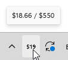
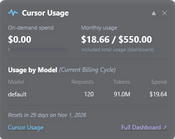
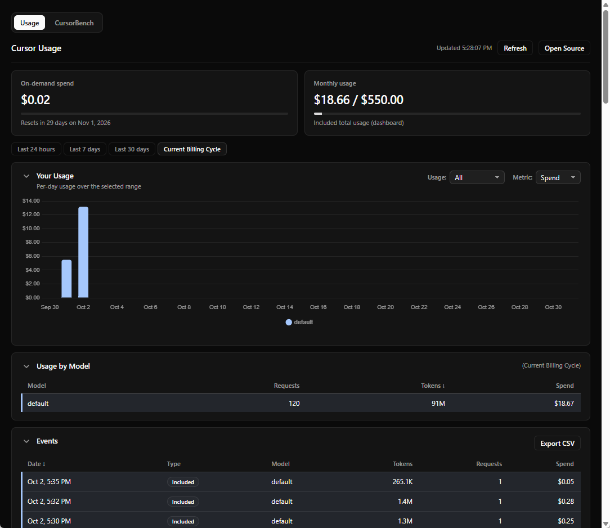
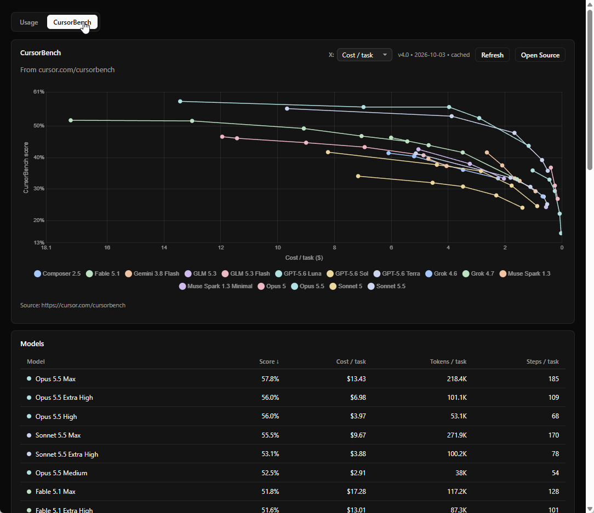

# Cursor Usage Tray

A lightweight, unobtrusive Windows system tray utility for real-time monitoring of your **Cursor AI** usage, quotas, on-demand spend, and model statistics.

Built with WPF and Windows Forms, targeting both **.NET 10** and **.NET Framework 4.8**.

---

## 💡 Motivation

When coding daily with [Cursor](https://cursor.com), it is easy to lose track of your plan limits, fast-request allowances, or on-demand usage charges until you unexpectedly hit a cap or exceed your monthly budget. 

Checking usage typically requires:
1. Opening a browser tab.
2. Navigating to `cursor.com/dashboard/usage`.
3. Waiting for authentication and page load.

**Cursor Usage Tray** solves this friction:
- **Ambient Awareness**: Keeps your current usage right in your Windows taskbar tray at all times.
- **Zero-Friction Authentication**: Automatically detects and reads the active session token stored locally by the Cursor desktop client—no API keys, login prompts, or password configuration required.
- **Instant Response**: Caches last-known metrics locally so the tray icon and flyout card render instantly (< 1 ms) on boot.

---

## ✨ Features & What It Offers

### 1. Dynamic System Tray Icon
- **Live Numbers in Tray**: Displays your current usage count or percentage directly drawn onto a custom dynamic tray icon.
- **Rich Hover Tooltip**: Displays a quick summary of used vs. total limit and billing cycle reset dates.
- **Taskbar Pinning**: Automatically promotes the icon to remain visible on the taskbar rather than being tucked into the hidden overflow menu.

<p align="center">
  
</p>

### 2. Sleek Quick-Access Flyout Card
- **Single-Click Popup**: Left-click the tray icon to pop up a modern, semi-transparent card anchored to the bottom-right corner of your screen.
- **Visual Progress Bar**: Color-coded usage indicator (green &rarr; amber &rarr; red) providing immediate visual feedback on remaining quota.
- **On-Demand & Team Spend Tracking**: Accurately shows both included plan usage and usage-based on-demand dollar spend.
- **Expandable Model Breakdown**: Click to expand a per-model breakdown table showing:
  - Model name (Claude 3.7 / 3.5 Sonnet, GPT-4o, etc.)
  - Total requests made
  - Total tokens processed (input, output, and cache read/write)
  - Dollar cost per model
- **Adjustable Opacity & Draggable**: Supports adjustable transparency (50% to 100%) and custom positioning.

<p align="center">
  
  &nbsp;&nbsp;&nbsp;&nbsp;
  
</p>

### 3. Integrated WebView2 Analytics Dashboard
- **Usage & CursorBench Window**: Open a full graphical dashboard powered by Microsoft Edge WebView2.
- **Interactive Charts**: Visual breakdown of requests, token distribution, and spending trends rendered with Chart.js.
- **CursorBench Integration**: Fetches and displays the latest benchmark metrics and model evaluations directly from `cursor.com/cursorbench` with 24-hour smart caching.

<p align="center">
  
</p>

<p align="center">
  
</p>

### 4. Background Settings & Customization
- **Configurable Polling Intervals**: Refresh every 1 minute, 5 minutes, or a custom interval in minutes.
- **Adjustable Transparency**: Presets for 100% (solid), 90%, 85%, 75%, 50%, or custom opacity.
- **Start with Windows**: Toggle seamless background startup via the Windows user registry.
- **Dual Runtime Support**: Compiles out-of-the-box for **.NET 10** (`net10.0-windows`) and legacy-friendly **.NET Framework 4.8** (`net48`).


---

## 🚀 Getting Started & Usage

### Prerequisites
1. **Windows 10 / 11** (64-bit or 32-bit).
2. **Cursor Desktop**: Installed and signed in (so local state database exists).
3. **Microsoft Edge WebView2 Runtime**: Required for the detailed dashboard window (pre-installed on Windows 11 and modern Windows 10 updates).
4. **Runtime**:
   - For **.NET 10 version**: .NET 10 Desktop Runtime (Windows Desktop).
   - For **.NET 4.8 version**: .NET Framework 4.8 (built-in on Windows 10/11).

### Running the App
Run either executable from the build outputs:
- **.NET 10**: `bin\Release\net10.0-windows\CursorUsageTray.exe`
- **.NET Framework 4.8**: `bin\Release\net48\CursorUsageTray.exe`

Once launched:
- Look for the icon in your system tray (notification area).
- **Left-Click** icon: Toggles the quick-view usage flyout card.
- **Right-Click** icon: Opens the context menu with options:
  - **Summary**: Displays current usage at top.
  - **Open Dashboard (Usage & Bench)**: Opens the rich analytics dashboard.
  - **Refresh interval**: Select 1 min, 5 min, or enter a custom interval.
  - **Transparency / Opacity**: Choose window transparency.
  - **Start with Windows**: Check or uncheck auto-start at logon.
  - **Open Card**: Re-opens the flyout card.
  - **Exit**: Quits the application.

---

## 🛠️ Building from Source

### Using .NET CLI
Build both `.NET 10` and `.NET 4.8` release binaries simultaneously:

```powershell
dotnet build -c Release
```

Build a specific target framework:

```powershell
# .NET 10 only
dotnet build -c Release -f net10.0-windows

# .NET Framework 4.8 only
dotnet build -c Release -f net48
```

### Running Unit Tests
Unit tests cover usage calculations, formatting, thresholds, and view model reactivity:

```powershell
dotnet test -c Release
```

---

## 📂 Configuration & Data Locations

| Item | Location | Purpose |
| :--- | :--- | :--- |
| **Cursor Auth Source** | `%APPDATA%\Cursor\User\globalStorage\state.vscdb` | Read-only access to Cursor's local session token. |
| **User Settings** | `%LOCALAPPDATA%\CursorUsageTray\settings.json` | Stores refresh intervals, opacity, and auto-start settings. |
| **Usage Cache** | `%LOCALAPPDATA%\CursorUsageTray\cache.json` | Caches last fetched usage for instant startup display. |
| **CursorBench Cache** | `%LOCALAPPDATA%\CursorUsageTray\cursorbench-cache.json` | Caches fetched benchmark data. |
| **WebView2 Data** | `%LOCALAPPDATA%\CursorUsageTray\WebView2\` | Isolated user data folder for embedded WebView2. |

---

## 🔒 Privacy & Security

- **Local Storage Only**: All communication happens directly between your machine and official `https://cursor.com` endpoints.
- **No Third-Party Relays**: No credentials, telemetry, or tokens are sent to any third-party servers.
- **Read-Only SQLite Access**: Opens the Cursor `state.vscdb` file in strict read-only mode to prevent any database contention or file locks with the running Cursor editor.
